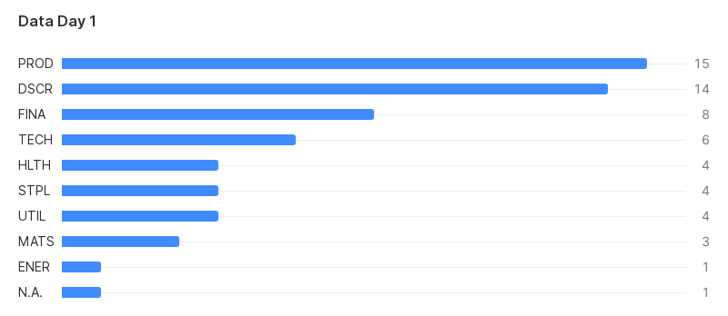

# Sustainable Data Day 1 : Data Acquisition with Snowflake

## Exercise 1 - Structured Data Integration

In this first exercise, we will create some reference tables that we will use during the workshops to classify data.
Our goal is to understand some basics of data management such as database, schema, table, file format, etc.

With the sustainable data day workshops, we aim to cover some functional knowledge on finance and ESG . 
So we start by explaining the business concept we will manipulate during the session.

## Functional scope of the workshop

This is the first session, so let's start with some basics on investment management and entities classification.

An **[investor](https://en.wikipedia.org/wiki/Investor)** is a person who allocates financial capital with the expectation of a future return (profit) or to gain an advantage (interest).
Types of **[investments](https://en.wikipedia.org/wiki/Investment)** include **[securities](https://en.wikipedia.org/wiki/Security_(finance))** (debt or equity), real estate, infrastructure, etc..

Securities are emitted by [**issuers**](https://en.wikipedia.org/wiki/Issuer) such as governments, corporations, or investment trusts.
An issuer is a **legal entity** that develops, registers and sells securities for the purpose of financing its operations.
Reciprocally, securities are often call an **issuings**.

Investors have an **"investment universe"** which are the **issuings**, ie. financial instruments (equity, bonds, loans, real-asset, etc.), they are actively monitoring and on which they can invest on.

Investors have to look at the financial performance of the issuing but also the risk profile of the issuer.
The risk can be correlated to the **sector**, **industry** or **region** of the issuer.

For example, Belgium company "AB InBev" can be classified in "Consumer Staples", "Brewery", "Europe".
Classification of issuing is inherited from his issuer.

Issuer and issuing must be uniquely identified. There are international codifications for that.
- **ISIN** is an international standard to uniquely identified a **"security"** to facilitate clearing, reporting and settlement of trades. ISIN codes have a total of 12 characters that consist of both letters and numbers. These include the country in which the issuing company is headquartered (first two digits), along with a number specific to the security (middle nine digits), and a final character, which acts as a check.
- **LEI** is the European standard for Legal Entity Identification. An LEI consists of a 20-character alphanumeric string, with the first four characters identifying the Local Operating Unit (LOU) that issued the LEI.

Issuer has a LEI, Issuing has a ISIN. An issuer is often identified by the ISIN of his stock (equity). 
"AB InBev" can be identify by his LEI '5493008H3828EMEXB082' and the ISIN of his stock 'BE0974293251' listed in **Euronext Brussels**, the belgium market exchange.

In order to keep things not too difficult, we have restricted the assets to 60 stocks of large French companies. 
This will be the **"investment universe"** used by all investors in our workshop. 

## Let's get into action

Connect to your snowflake account. Go to "Worksheets" in the left menu and create a new Worksheet by clicking the + button which should be on the right of the screen.
A worksheet is a place where you can manipulate data elements by using popular languages such as 'SQL' or 'Python'.
Select SQL Worksheet for this exercise. But let's start with some functional perspective.

Call the newly created worksheet `Data Day 1`. Snowflake will automatically save your worksheet for you, so you'll just have to open it directly next time. You'll find your worksheet in 'Recent' or 'My Worksheets' tab. A worksheet can also be share with collaborator. This is a very handy features!

### Table Creation

First, we will create a database `SUSTAINABLE_DATA_DAYS` and then a table `REGIONS`

You have to ensure that you have a proper 'role' with `SYSADMIN` privileges and a 'WAREHOUSE' to run query.
For this workshop, we have set up and will use a specific role and warehouse respectively called `DATADAY` and `DATADAY_WH`.

By default, Snowflake comes with a system role `SYSADMIN` and a default warehouse called `COMPUTE_WH`. 
You can use them for this workshop if you use your own snowflake account. You'll find the queries to create `DATADAY` and `DATADAY_WH` at the end.

As you may not be alone to perform this workshop during a live session, we recommend to add a suffix to your database.
You can use the same suffix number of you snowflake workshop account. So database `SUSTAINABLE_DATA_DAYSXY` will be `SUSTAINABLE_DATA_DAYS01` if you have the #01 user account. 
In case you are using your own Snowflake account, nothing to do here. You can use the SQL as is.

```sql
-- Make sure we use the proper role and warehouse
USE ROLE DATADAY;
USE WAREHOUSE DATADAY_WH; 

-- Create a database that will contains our table.
CREATE DATABASE SUSTAINABLE_DATA_DAYSXY;

-- Go in the database that will contains our table.
USE DATABASE SUSTAINABLE_DATA_DAYSXY;

-- Create a really basic table
CREATE OR REPLACE TABLE REGIONS (
  REGION_CODE CHAR(4),
  REGION_LONGNAME STRING
);
```
You simply have to 'copy/paste' the code above in your 'Data Day 1' worksheet. Don't forget to change database name if needed.

Note: 
- By default, Snowflake uses 'public' schema. A schema is a logical layer within database to organize tables. We won't go into specific here. Just have in mind that the full name of table 'Regions' is 'SUSTAINABLE_DATA_DAYS.PUBLIC.REGIONS'.
- Like many DBMS, Snowflake is case-insensitive. 

### Some basic data operations
Let's run some basic SQL statements.

SQL is an international standard and certainly the most use and recognize language for data manipulation. It has been designed for that goals. SQL stands for 'Structured Query Language'.
It is not a surprise that Snowflake has chosen SQL has default language even if Snowflake is based on a very modern cloud architecture.

- To add data in your table, we use INSERT command.
- To read data from your table, we use SELECT command.
- To update data in your table, we use UPDATE command.
- To delete data from your table, we use DELETE command.

```sql
-- Adding data to table with Insert command
INSERT INTO REGIONS values ('EME', 'EUROPE MIDDLE EAST AFRICA');

-- Querying Data from table, should return 1 row
SELECT * FROM REGIONS;

-- Change the code as 1 characters is missing
UPDATE REGIONS set REGION_CODE = 'EMEA' where REGION_CODE = 'EME';

-- Check the change with select, adding a where clause 
SELECT * FROM REGIONS WHERE REGION_CODE = 'EMEA';

-- Removing the strategy with isin
DELETE FROM REGIONS WHERE REGION_CODE = 'EMEA';

-- check that table is empty, should return no row
SELECT * FROM REGIONS;

-- Fill the table with some values
INSERT INTO REGIONS values 
    ('LATN', 'LATIN AMERICA'),
    ('NAMR', 'NORTH AMERICA'),
    ('ASIA', 'ASIA'),
    ('EURO', 'EUROPE'),
    ('PACA', 'PACIFIC & AUSTRALIA'),
    ('MEDI', 'MIDDLE EAST/MEDITERRANEAN'),
    ('AFRI', 'AFRICA');
```

Note: 
- Snowflake makes no difference between char, string and varchar field types. The performance is the same. If you know the max length of your attributes (ex: ISIN), it is still better to specify it so downstream application like Data Viz will be able to adapt. Also Snowflake does not pad char type with the space character ' '.
- Snowflake is an analytical database and does not enforce unicity constraint on table. Which means that you can have double entries. Snowflake only ensures 'Not null' constraint.
- Snowflake supports other languages such as python for data manipulation.

### Inserting investment universe from a structured file

Now, we will add data from a csv file. 
Initializing reference data with a file is very common if you dataset is getting bigger so you can maintain it in a dedicated repository.

CSV stands for Comma Separated Values. It is the most basic structured file format and it is massively use for data exchange.
First things first, we have to declare a FILE FORMAT in Snowflake to load the file.
It will help snowflake to perform some basic control to load properly the data from the file into the table.

As we are using a standard CSV format, this one will be easy. 
Snowflake can support a wide range of customized file format: from structured to semi-structured.

#### Creating file format and stage

We continue in you 'Data Day 1' worksheet.

```sql
-- Declare a new file format
CREATE OR REPLACE FILE FORMAT sdd_csv_format
    TYPE = 'CSV',
    SKIP_HEADER = 1,
    FIELD_DELIMITER = ';';
```
Note: Snowflake also uses SQL for the administration commands.

You will find `investment_universe.csv` in the `resources` folder of this project. 
We need to move this file on Snowflake. Snowflake use 'STAGE' for this purpose.
Each database can have their own stages, but you need to specify a file format.

```sql
-- The command below works because you are still on SUSTAINABLE_DATA_DAYS database.
-- Otherwise you can prefix the stage name with the database and schema name.
CREATE OR REPLACE STAGE sdd_stage
    FILE_FORMAT = sdd_csv_format
    COPY_OPTIONS = (ON_ERROR='skip_file')
    DIRECTORY = (ENABLE = TRUE);
```

#### Uploading investment universe into the stage

To push data from a computer into a snowflake stage, you usually use API. 
You can also use Snowflake Command Line Interface (Snowsql - see later) to transfer file from your computer to Snowflake stages.

Hopefully, you can also do it from Snowflake User interface. 
In Snowsigh, go into "Data > Databases". Find `SUSTAINABLE_DATA_DAYSXY` database, `PUBLIC` schema and in Stages `SDD_STAGE`. You should have a '+ Files' button at the top right.
You can use this feature to upload 'strategies.csv' file into the stage.

When done, come back to your `Data Day 1` worksheet and run:

```sql
LIST @sdd_stage;
```

You should see the file you have uploaded.

|name|size|md5|last_modified|
| ------------------------------- | --- | --- | --- |
|sdd_stage/investment_universe.csv|2,704|b50e0cb136d1b6350207328c1e48f734|Tue, 1 Aug 2023 16:05:11 GMT|

Then we will create the table Investment Universe and load data into it.

```sql
-- Create a strategies table to store the data from the csv file
CREATE OR REPLACE TABLE INVESTMENT_UNIVERSE (
  NAME STRING,
  ISIN CHAR(12),
  LEI CHAR(20)
);

-- We load data from the strategies.csv file from the SDD_STAGE stage into STRATEGIES TABLE
COPY INTO "SUSTAINABLE_DATA_DAYSXY"."PUBLIC"."INVESTMENT_UNIVERSE"
FROM '@"SUSTAINABLE_DATA_DAYSXY"."PUBLIC"."SDD_STAGE"/investment_universe.csv'
FILE_FORMAT = (FORMAT_NAME="SUSTAINABLE_DATA_DAYSXY"."PUBLIC"."SDD_CSV_FORMAT")
ON_ERROR=ABORT_STATEMENT;
```
Update the query to your database name accordingly.

When you execute the command, Snowflake should display following results: 

|file|status| rows_parsed |rows_loaded|error_limit|errors_seen|first_error|first_error_line|first_error_character|first_error_column_name|
| --- | --- |-------------| --- | --- | --- | --- | --- | --- | --- |
|sdd_stage/investment_universe.csv|LOADED| 61|61|1|0	|	|	|	|

Snowflake controls that a file is not inserted twice so if you run your command a second time, no row will be inserted.

You can query INVESTMENT_UNIVERSE table again, you should find many rows now.

```sql
-- Query table after file import.
SELECT * FROM INVESTMENT_UNIVERSE;
```

### Inserting issuer sector classification from a CSV file

Now, repeat the operation for issuer / sector classification.
The classification is in a CSV file [issuer - sector classification.csv](..%2F..%2Fresources%2Fissuer%20-%20sector%20classification.csv) with two columns LEI and sector code.
Create a table ISSUERS_SECTORS table that model both column and integrate the csv in it.
You should be able to use the same FILE FORMAT than previous exercise. 
You'll have 60 entries in the table.

When done, you should be able to run following query.
```sql
-- Linking sector classification with investment universe
SELECT s.sector_code, u.* FROM INVESTMENT_UNIVERSE u
INNER JOIN ISSUERS_SECTORS s on s.LEI = u.lei;
```

### Let's make it visual

In snowsight, it is very easy to visualize the result.

Take the following query and run it in your worksheet.
```sql
-- Some stats on issuers by sector
SELECT s.sector_code, count(name) count FROM INVESTMENT_UNIVERSE u
INNER JOIN ISSUERS_SECTORS s on s.LEI = u.lei
GROUP BY s.sector_code
ORDER BY count desc;
```
In the result part of the window, click on Chart (on the right after "Results").
Select Chart type : "Bar", Data > X-Axis : "SECTOR_CODE", Appearance > Orientation : "Horizontal".
You should view the chart below.



## Wrapping up

During this first exercise, we have discovered basic elements of data project:
- **Database**: Where you keep all your datasets in an organized manner;
- **Table**: Where your dataset is store physically in a queryable format;
- **SQL Query**: A human readable language to manipulate your dataset;
- **Role**: The privilege you have on the data platform. You can restrict access rights to data and limit the query you can perform;
- **Warehouse**: In snowflake, there is a clear separation between storage and compute. With warehouse, you can allocate exactly the power you need to perform a specific task such as integration, transformation, usage;
- **File Format**: Each dataset is organized in a specific way when it is store in a file. This can be call structure, model, schema, etc... You have to guide your DBMS on how to read the file. In snowflake, this is done with a 'File Format' .
- **Stage**: A location where you place temporally dataset before inserting in a table. You can store RAW data into a stage. You don't need to know the format in advance to copy a file into a stage. There is a stage in each snowflake database. You can also set up external stage on AWS S3 for example.

## Let's practice

In the resources folder, we provide 3 reference datasets:
- sectors
- subsectors
- industries

These datasets could be used later to display the long name of classifier instead ot the code. 

Again, the datasets are provided in files with file format that is slightly different.
It is still csv but text is double-quoted, separator is a comma and there is no header.
So you have to create a new file format and stage to load them into snowflake.
Have a look at [Snowflake documentation](https://docs.snowflake.com/en/sql-reference/sql/create-file-format) for more options.
The structure is the same for all files.
1st column is the code (4 characters) uses as reference, the 2nd column is the longname.

You have to create and load the 3 tables in 'SUSTAINABLE_DATA_DAYXY.PUBLIC' schema.

## Advanced

### Uploading file to Snowflake using command line interfacec 

Uploading a file from your computer is very easy. You can use Snowsql, the Snowflake command line interface (or CLI).
You need to have the rights to install Snowsql on your computer.

Here is how to copy the file strategies.csv in snowflake stage:
```shell
snowsql -a <youraccount> -u <yourusername> -d SUSTAINABLE_DATA_DAYS -r DATADAY -w DATADAY_WH -s PUBLIC
```

```sql
[LOGIN#DATADAY_WH@SUSTAINABLE_DATA_DAYS.PUBLIC>PUT file:///<your>/<user>/<path>/GitHub/SustainableDataDays/resources/strategies.csv @sdd_stage;
+----------------+-------------------+-------------+-------------+--------------------+--------------------+---------+---------+
| source         | target            | source_size | target_size | source_compression | target_compression | status  | message |
|----------------+-------------------+-------------+-------------+--------------------+--------------------+---------+---------|
| strategies.csv | strategies.csv.gz |        4734 |           0 | NONE               | GZIP               | SKIPPED |         |
+----------------+-------------------+-------------+-------------+--------------------+--------------------+---------+---------+
1 Row(s) produced. Time Elapsed: 0.464s
```
Here is the definition of the 'STRATEGIES' table.

```sql
CREATE OR REPLACE TABLE STRATEGIES (
  NAME STRING,
  ISIN CHAR(12)
);
```
You can try to upload the data in the  table.

### Set Up  Data day role
Here is how we setup the `DATADAY` role. You can run this query with a privilege role (like SYSADMIN).

```sql
CREATE ROLE "DATADAY" SET COMMENT = 'Role created for the Data Day workshop';
GRANT ROLE "DATADAY" TO ROLE "SYSADMIN";
```

#### Set Up Data day Warehouse
Here is how to setup the `DATADAY_WH`. You can run this query with a privilege role (like SYSADMIN or DATADAY).

```sql
CREATE WAREHOUSE "DATADAY_WH" SET WAREHOUSE_SIZE = 'XSMALL' AUTO_SUSPEND = 600 AUTO_RESUME = TRUE MIN_CLUSTER_COUNT = 1 MAX_CLUSTER_COUNT = 1 SCALING_POLICY = 'STANDARD' COMMENT = 'Warehouse dedicated to the Data Day workshop';
```

